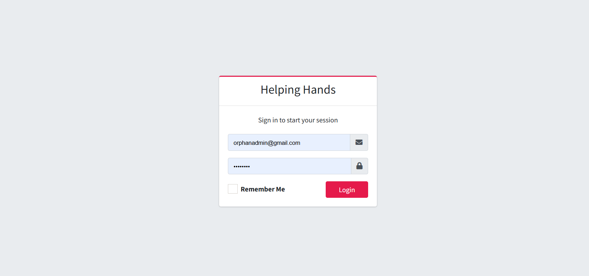
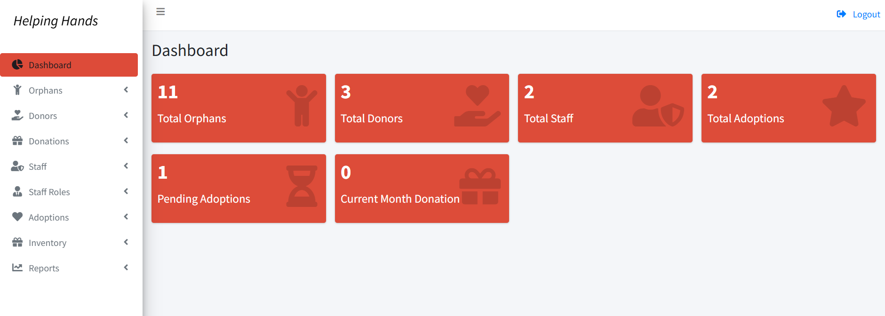
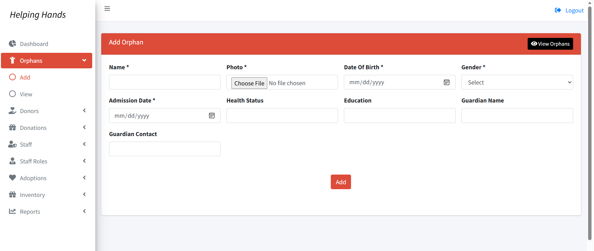
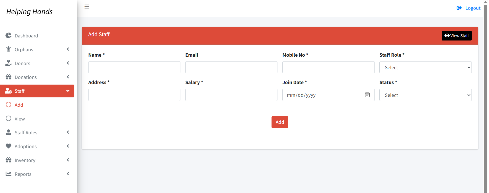
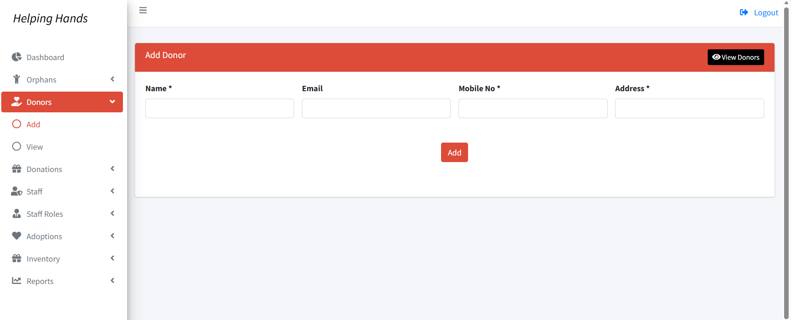
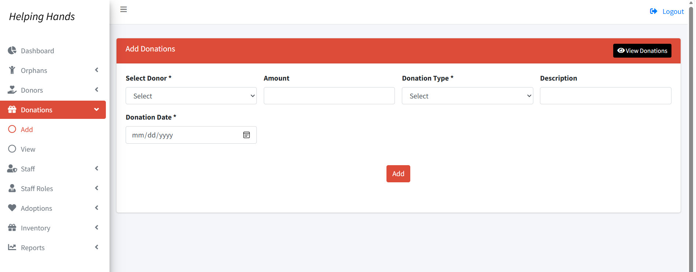
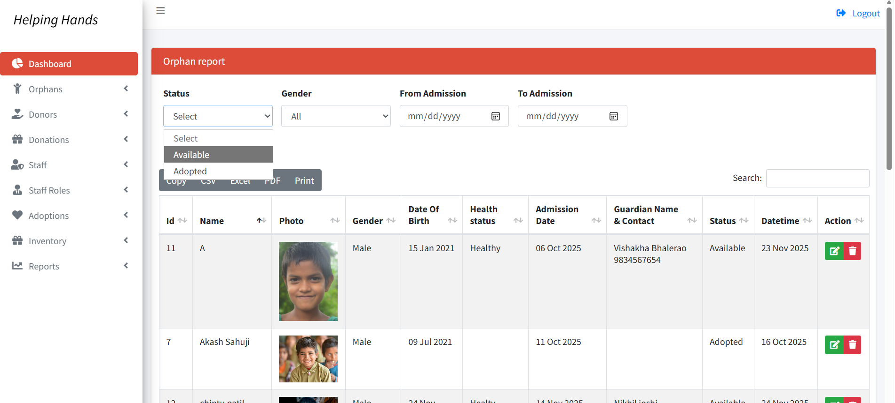
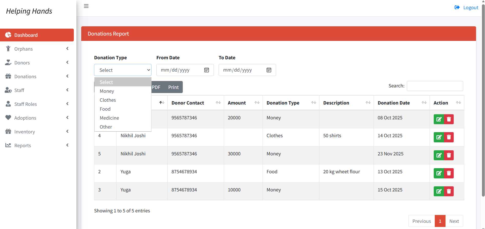
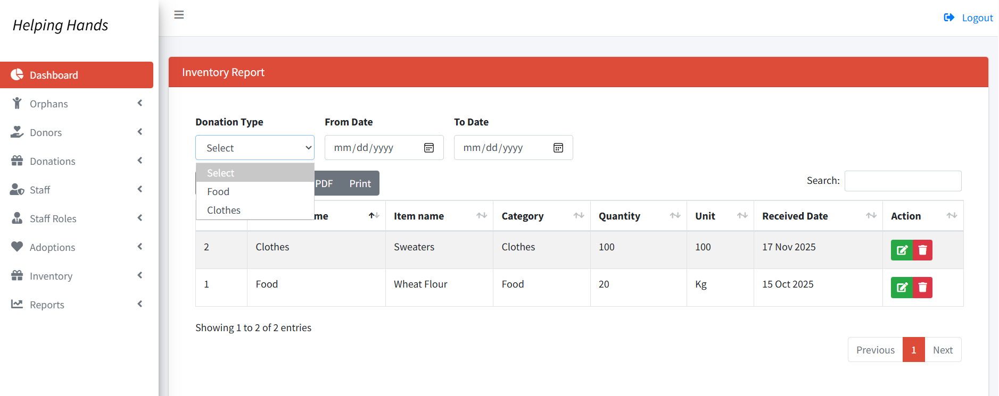

# 🏠 Orphanage Management System

A web-based **Orphanage Management System** developed using **PHP, MySQL, HTML, CSS, Bootstrap, JavaScript, and jQuery**. The system helps manage orphan records, staff, donors, donations, inventory, and reports through an easy-to-use admin dashboard.

---

# ✨ Features

- 🔐 Secure Admin Login
- 👶 Orphan Management
- 👨‍💼 Staff Management
- ❤️ Donor Management
- 💰 Donation Management
- 📦 Inventory Management
- 📊 Reports
- 🔍 Search & Filter Records
- ✏️ Complete CRUD Operations (Create, Read, Update, Delete)
- 📱 Responsive Interface

---

# 🛠️ Technologies Used

- PHP
- MySQL
- HTML5
- CSS3
- Bootstrap
- JavaScript
- jQuery
- AdminLTE

---

# 📸 Screenshots

## Login Page



---

## Dashboard



---

## Orphan Management

### Add Orphan



### View All Orphans


---

## Staff Management

### Add Staff



### View All Staff


---

## Donor Management

### Add Donor



### View All Donors


---

## Donation Management

### Add Donation



### View All Donations


---

## Reports

### Orphan Report



### Donation Report



### Inventory Report



---

# ⚙️ Installation

1. Clone the repository

```bash
git clone https://github.com/Yuga005/orphanage-management-system.git
```

2. Move the project into the **htdocs** folder of XAMPP.

3. Start **Apache** and **MySQL**.

4. Import the SQL file located in:

```text
database/orphanage_db.sql
```

5. Update the database connection settings if required.

6. Open your browser and visit:

```text
http://localhost/OrphanageManagementSystem
```

> **Note:** If Apache is configured on a different port (for example, **8080**), use:
>
> `http://localhost:8080/OrphanageManagementSystem`

---

# 🗄️ Database

The SQL file required to run this project is available in the **database** folder.

---

# 🚀 Future Enhancements

- Email Notifications
- Online Donation Integration
- SMS Alerts
- Multi-user Role Management
- Analytics Dashboard
- Document Upload Facility

---

# 👩‍💻 Author

**Yugandhara Dolare**

GitHub: https://github.com/Yuga005